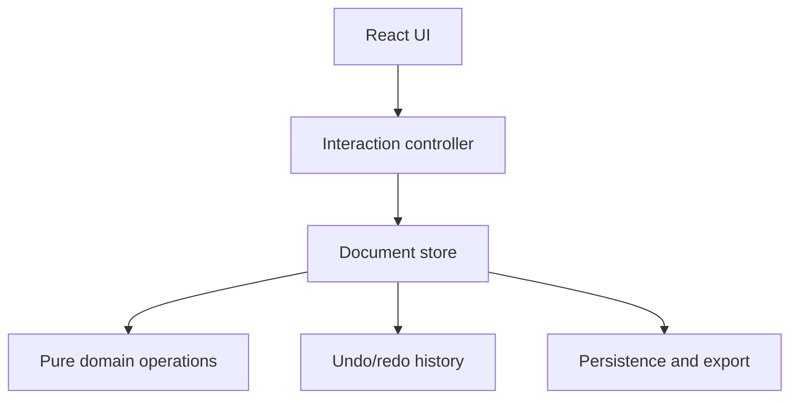

# Phase 1 Solution Design: Linear Diagram Editor MVP

**Project:** `bizlex/drag-drop-diagram`  
**Repository:** <https://github.com/bizlex/drag-drop-diagram>  
**Document status:** Proposed baseline for implementation  
**Document version:** 1.0  
**Target schema version:** 1  
**Last updated:** 2026-08-15

## 1. Purpose of this document

This document is the source of truth for Phase 1 of the project. It defines:

- what must and must not be implemented;
- the technical architecture and persistent data format;
- expected user interactions;
- acceptance criteria and test strategy;
- how work should be split between GPT-5.6 Sol, Terra, and Luna;
- rules that an AI coding agent must follow when changing the repository.

If an implementation decision conflicts with this document, the agent must stop and explicitly report the conflict instead of silently changing the design.

## 2. Product context

The product is a browser-based editor for building structural diagrams of a text, primarily linear diagrams similar in purpose to the diagramming tools available in Logos Bible Software. The longer-term product may also support phrasing/phasing, clause grouping, indentation, labels, and exegetical annotation.

Phase 1 does not attempt to reproduce all Logos functionality. Its purpose is to establish a reliable editor core that later phases can extend without rewriting the document model or interaction layer.

The primary expected texts are Russian, English, Ancient Greek, and Hebrew. The editor must preserve Unicode text without transliteration or normalization that changes visible characters.

## 3. Current repository assessment

The current `main` branch is an early Create React App prototype written in JavaScript. It contains:

- `TextField`, which splits text by spaces;
- draggable words implemented with React DnD;
- `DiagramField`, which stores dropped words in local component state;
- a placeholder toolbox with `Line` and `Arrow` items;
- GitHub Pages deployment configuration.

The prototype demonstrates the basic idea, but it is not a safe foundation for incremental feature additions because:

- repeated words are identified by their text rather than by unique identifiers;
- drop coordinates use viewport coordinates instead of canvas coordinates;
- the source panel and canvas own separate, weakly coordinated state;
- list indexes are used as React keys;
- toolbox items are not accepted or rendered by the canvas;
- there is no persistent document model, validation, undo/redo, import, or export;
- `react-scripts` 3 is inconsistent with the current React dependency and is obsolete for a new implementation;
- React DnD's HTML5 backend is not a good foundation for all SVG pointer interactions and touch input.

### Decision

Rebuild the application core inside the same repository. Preserve the old implementation in Git history; do not maintain a compatibility layer for the prototype's component state.

## 4. Phase 1 objective

Deliver a dependable single-document linear diagram editor in which the user can:

1. enter a source text;
2. create uniquely identified draggable tokens from it;
3. place and reposition tokens on an SVG canvas;
4. draw straight lines, arrows, and junction points;
5. select and delete diagram elements;
6. undo and redo editing operations;
7. automatically restore the working document after reload;
8. import and export the document as validated JSON;
9. export the diagram as SVG and PNG;
10. use the deployed application from GitHub Pages.

## 5. Scope boundaries

### 5.1 In scope

- One active diagram document in the browser.
- Source text entry and explicit diagram creation.
- Whitespace-based Unicode-safe tokenization.
- Unique and stable token identifiers, including repeated words.
- Placement of each source token on the canvas no more than once.
- Moving placed word elements.
- Straight line and arrow connectors.
- Horizontal, vertical, and 45-degree constraint while holding `Shift`.
- Junction points and endpoint snapping.
- Single-element selection.
- Delete, undo, redo, and common keyboard shortcuts.
- Local autosave.
- Versioned JSON import/export with runtime validation.
- SVG and PNG image export.
- Desktop-first responsive layout.
- Basic touch support through Pointer Events.
- Unit, integration, and essential Playwright end-to-end tests.
- Static deployment to GitHub Pages.

### 5.2 Explicitly out of scope

- User accounts, server storage, synchronization, and collaboration.
- Multiple-document library or folders.
- Real-time collaboration.
- Automatic syntactic or semantic analysis.
- Automatic Bible text retrieval.
- Full phrasing/phasing mode.
- Clause nesting, semantic labels, annotations, colors, and brackets.
- Curved or multi-segment connectors.
- Multi-selection, grouping, copy/paste, and alignment tools.
- Canvas zoom, pan, minimap, or infinite canvas.
- Mobile-first user experience.
- PDF export.
- Backward compatibility with undocumented prototype state.

Requests for these features must be recorded for later phases and must not be added opportunistically during Phase 1.

## 6. User experience

### 6.1 Main layout

Desktop layout:

- source text and available tokens: approximately one third of the width;
- diagram workspace: approximately two thirds of the width;
- compact toolbox: docked at the right side of the workspace or in its upper toolbar.

The diagram workspace is the main focus. It must not be reduced to less than 60% of the available width on normal desktop screens.

On narrow screens, the source panel and toolbox may collapse above the canvas. Full mobile optimization is not required in Phase 1.

### 6.2 Primary workflow

1. The user enters or pastes source text.
2. The user presses **Create diagram**.
3. The application tokenizes the text and creates a new empty document.
4. The source text becomes locked; tokens remain available in the source panel.
5. The user drags tokens to the canvas.
6. The user chooses Select, Line, Arrow, or Junction tools to build the diagram.
7. Changes are automatically saved locally.
8. The user may export JSON, SVG, or PNG.

If a diagram already contains elements, editing the source text requires an explicit destructive confirmation. Confirming the change creates a fresh token list and clears the existing diagram. Incremental reconciliation of edited source text is not part of Phase 1.

### 6.3 Tools

| Tool | Behavior |
| --- | --- |
| Select | Selects and moves words, junctions, and connector endpoints. This is the default tool. |
| Line | Pointer down sets the start; pointer move previews; pointer up commits a straight line. |
| Arrow | Same as Line, with an arrowhead at the end. |
| Junction | Click creates a visible junction point. |

Holding `Shift` while drawing constrains the connector to the nearest 0°, 45°, 90°, 135°, and equivalent angle.

### 6.4 Selection and keyboard behavior

- Click an element to select it.
- Click an empty canvas area or press `Escape` to clear selection.
- Press `Delete` or `Backspace` to delete the selected element.
- `Ctrl/Cmd+Z` performs undo.
- `Ctrl/Cmd+Shift+Z` and `Ctrl+Y` perform redo.
- A whole drag gesture creates one history entry, not one entry per pointer movement.
- Keyboard shortcuts must not fire while the user is typing in a text input or textarea, except for native text editing behavior.

## 7. Technical decisions

### 7.1 Technology stack

| Concern | Decision |
| --- | --- |
| Language | TypeScript in strict mode |
| UI | React 18.3.1, preserving the repository's current React major/minor version |
| Build | Vite |
| Diagram rendering | Native SVG elements rendered by React |
| Interaction | Browser Pointer Events and pointer capture |
| Document state | Pure reducer/domain operations with a thin React store/provider |
| Runtime validation | Zod |
| Unit/integration tests | Vitest + React Testing Library |
| End-to-end tests | Playwright |
| Styling | CSS Modules |
| Deployment | GitHub Actions to GitHub Pages |

### 7.2 Libraries deliberately not used

- **D3:** unnecessary for Phase 1 because no graph layout or data visualization algorithm is required.
- **React DnD:** do not carry it forward. SVG manipulation and touch behavior are easier to control consistently with Pointer Events.
- **Canvas rendering libraries:** Konva/Fabric are not required. Native SVG provides inspectable output and straightforward SVG export.
- **Large UI frameworks:** avoid adding a design system dependency for the MVP.

Any new production dependency requires a short justification in the pull request or task summary.

## 8. Architecture



### 8.1 Architectural rules

1. The persisted `DiagramDocument` is the authoritative product state.
2. Selection, hover, drag previews, open dialogs, and the active tool are UI state and are not persisted in the document.
3. Domain operations must be pure and independently testable.
4. Pointer-move previews must not mutate the persisted document or history.
5. A completed gesture commits one domain operation.
6. Components must not maintain competing copies of document elements.
7. Coordinates stored in the document are always SVG user-space coordinates.
8. Import must validate data before it replaces the current document.

### 8.2 Suggested source structure

```text
src/
  app/
    App.tsx
    AppShell.tsx
  domain/
    diagram/
      types.ts
      schema.ts
      operations.ts
      reducer.ts
      selectors.ts
      tokenizer.ts
  features/
    source-text/
    canvas/
      DiagramCanvas.tsx
      WordElement.tsx
      ConnectorElement.tsx
      JunctionElement.tsx
      useCanvasInteraction.ts
    toolbox/
    history/
    persistence/
    export/
  shared/
    geometry/
    ids/
    keyboard/
  styles/
tests/
  e2e/
```

The exact number of files may vary, but domain logic must not be hidden inside large JSX components.

## 9. Document model

The following TypeScript is normative in meaning. Minor naming changes are allowed only if they improve clarity without changing the relationships.

```ts
type EntityId = string;

interface DiagramDocument {
  schemaVersion: 1;
  id: EntityId;
  title: string;
  sourceText: string;
  tokens: SourceToken[];
  elements: DiagramElement[];
  canvas: CanvasSettings;
  createdAt: string;
  updatedAt: string;
}

interface SourceToken {
  id: EntityId;
  index: number;
  text: string;
}

interface CanvasSettings {
  width: number;
  height: number;
  background: string;
}

type DiagramElement = WordElement | JunctionElement | ConnectorElement;

interface WordElement {
  id: EntityId;
  type: 'word';
  tokenId: EntityId;
  x: number;
  y: number;
}

interface JunctionElement {
  id: EntityId;
  type: 'junction';
  x: number;
  y: number;
}

interface ConnectorElement {
  id: EntityId;
  type: 'connector';
  variant: 'line' | 'arrow';
  start: ConnectorEndpoint;
  end: ConnectorEndpoint;
}

type ConnectorEndpoint =
  | { kind: 'point'; x: number; y: number }
  | {
      kind: 'word-anchor';
      elementId: EntityId;
      anchor: 'top' | 'right' | 'bottom' | 'left';
    }
  | { kind: 'junction'; elementId: EntityId };
```

### 9.1 Model invariants

- Every entity has a unique stable ID generated with `crypto.randomUUID()` behind an injectable ID helper.
- `SourceToken.index` preserves original token order.
- Every `WordElement.tokenId` references an existing token.
- A token may be referenced by no more than one `WordElement`.
- Every referenced word or junction endpoint must exist.
- Connector start and end must not resolve to the same coordinate.
- All numeric coordinates must be finite.
- Timestamps are ISO 8601 strings.
- Unknown schema versions are rejected with a useful error and do not overwrite the current document.
- Deleting a word or junction cascades to every connector that references it. Undo restores the complete deletion as one operation.

### 9.2 Tokenization

Phase 1 tokenization splits the source text on one or more Unicode whitespace characters. Each non-whitespace run becomes one token. Punctuation remains attached to the run in which it appears.

Example:

```text
Source:  In the beginning, God created.
Tokens:  [In] [the] [beginning,] [God] [created.]
```

This intentionally avoids language-specific linguistic tokenization. It correctly keeps duplicate strings as different tokens because identity comes from the generated ID and source index, not from `text`.

Source text must not be lowercased, transliterated, or Unicode-normalized in a way that changes the visible input. Tests must cover Cyrillic, polytonic Greek, Hebrew, punctuation, repeated words, tabs, and multiple line breaks.

## 10. Coordinate and geometry model

### 10.1 Coordinate conversion

Never persist `clientX`, `clientY`, page coordinates, or CSS pixel offsets directly.

Convert pointer positions into SVG user-space coordinates using the SVG element's current transformation matrix:

```ts
function clientPointToSvg(svg: SVGSVGElement, clientX: number, clientY: number) {
  const matrix = svg.getScreenCTM();
  if (!matrix) throw new Error('SVG transformation matrix is unavailable');

  return new DOMPoint(clientX, clientY).matrixTransform(matrix.inverse());
}
```

This conversion must be used for dropping words, moving elements, drawing connectors, and moving connector endpoints.

### 10.2 Anchors and snapping

- Word anchors are computed from the rendered word bounding box.
- A connector endpoint within 8 SVG units of an anchor or junction snaps to it.
- Snapped endpoints store a semantic reference, not copied coordinates.
- Moving a word or junction therefore moves all attached connector endpoints automatically.
- Free endpoints store absolute SVG coordinates.

### 10.3 Rendering layers

Render SVG content in this order:

1. canvas background;
2. connectors;
3. junctions;
4. words;
5. selection outlines and interaction previews.

Interaction previews are excluded from export.

## 11. State transitions and history

Domain actions should be explicit. Expected operations include:

- `CREATE_DOCUMENT_FROM_TEXT`
- `PLACE_TOKEN`
- `MOVE_ELEMENT`
- `ADD_CONNECTOR`
- `ADD_JUNCTION`
- `MOVE_CONNECTOR_ENDPOINT`
- `DELETE_ELEMENT`
- `RESET_DOCUMENT_FROM_TEXT`
- `REPLACE_DOCUMENT_FROM_IMPORT`

Undo/redo stores document snapshots:

```ts
interface DocumentHistory {
  past: DiagramDocument[];
  present: DiagramDocument;
  future: DiagramDocument[];
}
```

Snapshot history is acceptable for Phase 1 because documents are expected to be small. Limit history to the most recent 100 committed operations. A new operation after undo clears `future`.

Autosave, selection changes, hover, and pointer-move previews must not create history entries.

## 12. Persistence and interchange

### 12.1 Autosave

- Store one active document in `localStorage` under a namespaced, versioned key.
- Debounce writes by approximately 300–500 ms.
- Load and validate the saved document during application startup.
- If validation fails, leave the saved bytes untouched, start with a recoverable empty state, and show a non-technical error with an option to download the invalid JSON for diagnosis.

### 12.2 JSON export/import

- Export the complete `DiagramDocument` as UTF-8 pretty-printed JSON.
- Use a safe filename derived from the document title.
- Validate imported JSON with Zod before changing application state.
- Import is atomic: either the whole document is accepted or nothing changes.
- Importing a valid document creates one history boundary and then becomes the new autosave value.

### 12.3 Schema evolution

Every persisted document contains `schemaVersion`. Phase 1 implements only version 1. Future schema changes must add explicit migration functions such as `migrateV1ToV2`; do not reinterpret old data silently.

## 13. Image export

### 13.1 SVG

- Clone only the exportable SVG content.
- Calculate a content bounding box with configurable padding.
- Set the exported `viewBox`, width, and height from that box.
- Include required inline styles and SVG arrow marker definitions.
- Exclude selection handles, hover highlights, and tool previews.
- Preserve Unicode text.

### 13.2 PNG

- Serialize the prepared export SVG.
- Render it to an off-screen canvas at a scale factor of 2 for readable text.
- Download a PNG with a transparent or document-configured background.
- Revoke temporary object URLs after use.

An export error must be surfaced to the user; it must not silently produce an empty file.

## 14. Error handling

Expected user-facing errors include:

- invalid or unsupported JSON document;
- local autosave could not be restored;
- SVG coordinate transformation is unavailable;
- SVG or PNG export failed;
- browser storage quota was exceeded.

Do not expose stack traces in the interface. Log diagnostic details to the developer console and display a concise recoverable message to the user.

## 15. Testing strategy

### 15.1 Unit tests

Unit tests must cover:

- tokenizer behavior and unique IDs;
- document invariants and Zod validation;
- all domain operations;
- deletion of elements referenced by connectors;
- endpoint resolution and snapping;
- angle constraint calculations;
- SVG coordinate conversion helpers where browser APIs can be mocked safely;
- undo/redo boundaries and the 100-entry limit;
- invalid JSON rejection;
- safe export filenames.

### 15.2 React integration tests

Integration tests must cover:

- creating a document from source text;
- displaying available and placed tokens correctly;
- selecting and deleting elements;
- keyboard shortcuts without intercepting textarea editing;
- import error messaging;
- toolbar state and disabled actions.

### 15.3 Playwright end-to-end tests

At minimum, the deployed production build must pass these scenarios:

1. Create a diagram from text containing a repeated word.
2. Place both occurrences independently and move one without moving the other.
3. Draw a line, an arrow, and a junction.
4. Attach a connector endpoint and verify it follows a moved element.
5. Delete an element, undo, and redo.
6. Reload and verify autosave restoration.
7. Export JSON, clear the application, import JSON, and verify restoration.
8. Trigger SVG and PNG downloads and verify non-empty files.
9. Run a smoke scenario using Greek and Hebrew text.

Tests should use stable semantic locators (`getByRole`, accessible names, or deliberate `data-testid` values for canvas entities). They must not rely on generated CSS class names.

## 16. Non-functional requirements

- TypeScript `strict` must remain enabled.
- Production build must complete without TypeScript or ESLint errors.
- No unhandled browser-console errors in the Playwright happy path.
- Common operations must remain responsive with at least 300 tokens and 500 diagram elements on a normal desktop browser.
- All toolbar buttons require accessible names and visible focus states.
- Color must not be the only indication of selection.
- The application must work in the current stable Chrome, Firefox, and Safari releases targeted by the project.

## 17. Implementation work packages

The model assignment below follows the practical rule: Sol for ambiguous/high-risk architectural work, Terra for the main implementation and integration work, and Luna for narrowly specified, repeatable tasks with objective acceptance tests.

| ID | Work package | Preferred model | Reasoning | Exit criteria |
| --- | --- | --- | --- | --- |
| P1-01 | Create migration branch, replace CRA with Vite + React + TypeScript, configure lint/test/build | Terra | Medium | Clean install, test, lint, and production build succeed |
| P1-02 | Implement document types, Zod schema, invariants, ID helper, reducer operations | Sol | High | Domain API and tests pass; no React dependencies in domain logic |
| P1-03 | Implement tokenizer and source-text workflow | Luna | Medium | Unicode, whitespace, repeated-word, lock/reset tests pass |
| P1-04 | Render SVG canvas, words, layers, selection visuals, coordinate helpers | Terra | High | Words render at document coordinates; scroll does not corrupt placement |
| P1-05 | Implement pointer interaction controller for placement and movement | Sol or Terra | High | Mouse and touch-style pointer tests pass; one gesture equals one commit |
| P1-06 | Implement Line, Arrow, Junction, angle constraint, anchors, and snapping | Sol or Terra | High | Attached endpoints follow moved words/junctions |
| P1-07 | Implement selection, deletion, keyboard shortcuts, and undo/redo | Terra | Medium | Keyboard and history acceptance tests pass |
| P1-08 | Implement autosave and validated JSON import/export | Luna for helpers; Terra for integration | Medium | Reload and import/export E2E tests pass |
| P1-09 | Implement SVG and PNG export | Terra | High | Both downloads are non-empty and omit editor-only UI |
| P1-10 | Complete accessibility, Playwright suite, GitHub Pages workflow, README | Luna for repetitive additions; Terra for integration | Medium | CI is green and deployed smoke test passes |
| P1-11 | Final architecture, regression, and scope audit | Sol | High | No critical findings; all Definition of Done items verified |

### Recommended model usage

- Do not ask Luna to implement all of Phase 1 in one request.
- Give Luna one work package or one clearly bounded subtask at a time.
- Use Terra as the default implementation model when a task crosses several layers.
- Use Sol before implementation for P1-02/P1-05/P1-06 and after implementation for P1-11.
- Increase reasoning effort only for geometry, history, schema, and cross-feature integration. Higher effort consumes more usage and is unnecessary for routine file conversions or repetitive tests.

The model names and roles are based on the current official OpenAI model guidance: <https://learn.chatgpt.com/docs/models>. If the available model family changes, preserve the work-package risk categories and remap them to the current flagship, balanced, and fast models.

## 18. Agent operating contract

Every coding agent working on Phase 1 must follow these rules:

1. Read this entire document before editing code.
2. State the selected work-package ID and implement only that package.
3. Inspect the current repository state and existing changes before editing.
4. Preserve unrelated user changes.
5. Do not add out-of-scope features.
6. Do not change the document schema, architecture, or production dependencies without explicitly reporting the reason first.
7. Keep domain logic separate from React components.
8. Add or update tests in the same change as behavior.
9. Run the smallest relevant tests during development and the full required verification before completion.
10. Report changed files, commands run, results, unresolved risks, and the next work package.
11. Never claim success when tests or the production build were not run.
12. If requirements are ambiguous, prefer the smallest implementation compatible with this document and record the assumption.

### Required completion report

At the end of each work package, the agent must report:

```text
Work package:
Outcome:
Files changed:
Tests added/updated:
Verification commands and results:
Design decisions or assumptions:
Known limitations:
Recommended next package:
```

## 19. Prompt template for a coding session

Use this template when starting a new model session:

```text
Repository: bizlex/drag-drop-diagram
Authoritative design: docs/PHASE_1_SOLUTION_DESIGN.md
Work package: <P1-XX>

Read the full Solution Design and inspect the current repository before editing.
Implement only the selected work package and its exit criteria.
Do not change architecture, schema, dependencies, or scope silently.
Preserve unrelated changes.
Add or update tests together with the implementation.
Run the required verification and return the completion report defined in section 18.
If the repository state conflicts with the design, stop and explain the conflict before changing code.
```

For Luna, append an even narrower list of files, expected functions, and exact test cases. For Sol or Terra, allow the model to propose file boundaries while keeping the normative architecture and scope unchanged.

## 20. Definition of Done for Phase 1

Phase 1 is complete only when all of the following are true:

- [ ] The application uses Vite, React, and strict TypeScript.
- [ ] The old prototype state architecture is removed from the active application.
- [ ] Source text produces stable, unique tokens, including duplicates.
- [ ] Words can be placed and moved using correct SVG coordinates.
- [ ] Lines, arrows, and junctions can be created and edited.
- [ ] Connector endpoints can snap and remain attached to moved elements.
- [ ] Selection, deletion, undo, and redo work as specified.
- [ ] One completed gesture produces one history entry.
- [ ] Autosave restores a valid document after reload.
- [ ] Invalid JSON never replaces the current document.
- [ ] JSON, SVG, and PNG exports work.
- [ ] Cyrillic, Greek, and Hebrew smoke cases render without corrupted text.
- [ ] Unit and integration tests pass.
- [ ] Required Playwright scenarios pass against the production build.
- [ ] Lint and production build pass.
- [ ] GitHub Pages deployment succeeds.
- [ ] README explains setup, development commands, supported behavior, limitations, and deployment.
- [ ] Final Sol audit finds no unresolved critical architecture or data-integrity issue.

## 21. Known risks and mitigations

| Risk | Impact | Mitigation |
| --- | --- | --- |
| Incorrect coordinate spaces | Elements jump after scroll or responsive resize | Centralize conversion through `getScreenCTM().inverse()` and test scrolled layouts |
| Too many history snapshots during drag | Memory growth and unusable undo | Keep preview transient and commit once on pointer up |
| Duplicate token text | Wrong occurrence moves or disappears | Stable token IDs; never identify by text or array index |
| Dangling connector references | Invalid document and export failures | Enforce deletion policy and validate invariants after domain operations |
| SVG text size differs across browsers | Anchor positions vary slightly | Resolve anchors from rendered bounds and avoid persisting measured dimensions |
| Font/export inconsistencies | Export differs from editor | Use a controlled fallback font stack and inline essential SVG styles |
| Luna changes architecture while doing a broad task | Rework and inconsistent code | Give Luna bounded packages with exact tests; use Terra/Sol for integration reviews |
| Scope expands into full phrasing | Phase 1 never stabilizes | Enforce the explicit out-of-scope list and maintain a later-phase backlog |

## 22. Deferred Phase 2 candidates

These items are intentionally deferred but the Phase 1 model should not prevent them:

- phrase/clause groups and nested hierarchy;
- automatic indentation and alignment;
- semantic labels and annotations;
- bracket and multi-segment connector types;
- color coding and reusable styles;
- multiple saved documents;
- pan, zoom, and larger/infinite workspaces;
- copy/paste, multi-select, grouping, and alignment;
- richer language-aware tokenization;
- cloud synchronization and collaboration.

Phase 2 must begin with a review of actual Phase 1 usage rather than assuming all deferred features are still necessary.
